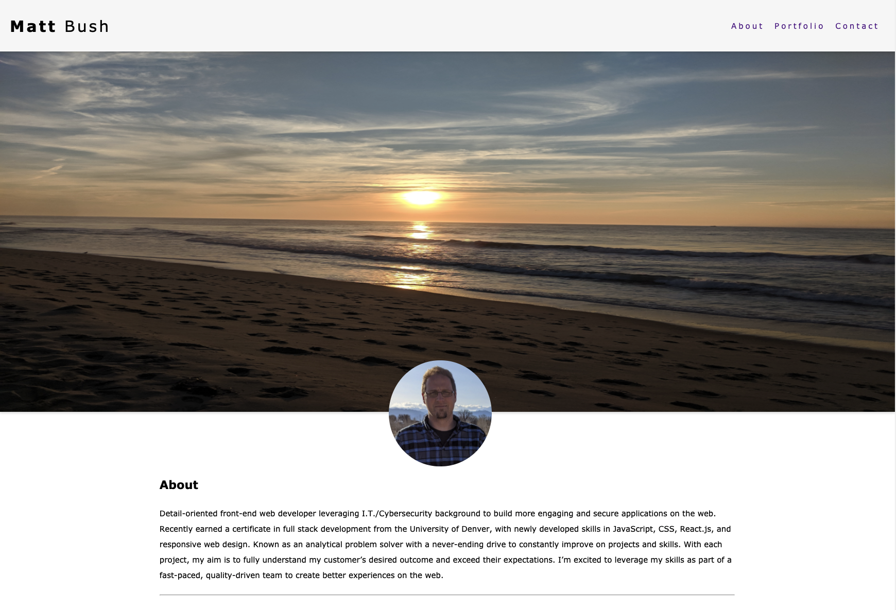
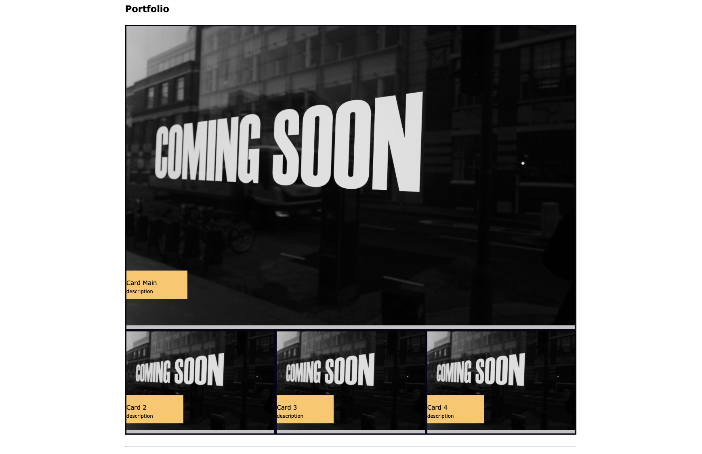

# Homework Assignment #2: Professional Portfolio

## Overview

This assignment demonstrates skills learned in Week 1 and 2 of the bootcamp creating a professional portfolio of projects that I have created in the bootcamp. The purpose of this project is do provide potential employers with a user-friendly and responsive website that highlights my skills in web development. The code consists of HTML & CSS and adheres to acceptance criteria specified in an included user story.

> As of July 28th 2021, this project only includes code in languages that we have learned so far, which is HTML and CSS. Links to my projects are placeholders that will be updated as projects are completed throughout the bootcamp.

## Link to Deployed Application

[professional-portfolio](https://github.com/matthewbush55/professional-portfolio)

## Mock-Up

The following image shows the refactored web application's appearance and functionality.

